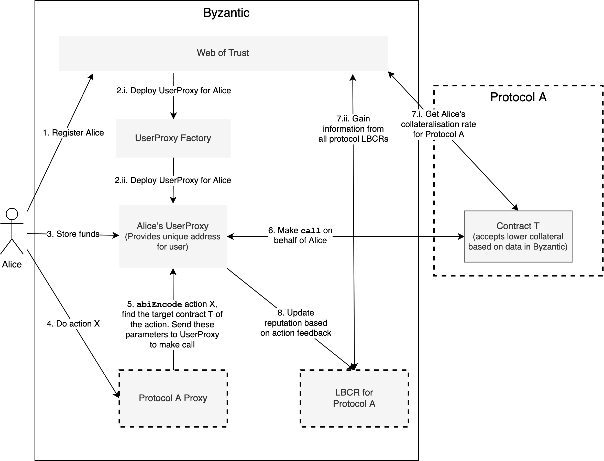

# Byzantic

[![Contributors][contributors-shield]][contributors-url]
[![Forks][forks-shield]][forks-url]
[![Stargazers][stars-shield]][stars-url]
[![Issues][issues-shield]][issues-url]
[![MIT License][license-shield]][license-url]


<!-- TABLE OF CONTENTS -->
## Table of Contents

* [About the Project](#about-the-project)
  * [Built With](#built-with)
* [Getting Started](#getting-started)
  * [Prerequisites](#prerequisites)
* [Usage](#usage)
* [Documentation](#documentation)
* [Roadmap](#roadmap)
* [License](#license)


<!-- ABOUT THE PROJECT -->
## About The Project



Byzantic aims to compute cross-protocol reputation for DeFi users. By performing desired actions in one protocol, the user can reduce
their collateral ratio across all protocols that integrate with Byzantic.

Protocols that integrate with Byzantic need to change the portion of their code that retrieves collateralization ratios. Besides using action specific collateralization ratios, protocols should query Byzantic to learn if the user deserves a reduction in collateral. For instance, if borrowing an asset requires 150% overcollateralization and the borrowing user has a good reputation across DeFi, Byzantic may deem the user worthy of only paying 90% of the collateral (90% x 150% = 135% overcollateralization). 

For every protocol that integrates with this solution, Byzantic will keep a Layered Behaviour-Curated Registry (LBCR) of users, which assigns agents (users) into layers, higher layers corresponding to lower collateral. Byzantic is a round-based protocol. For every LBCR, at the end of a round users are either promoted to a higher layer, demoted, or kept in the same layer, based on the actions they have taken during the round and how much they were in accordance with the interests of protocols. When Byzantic is queried about the reputation of a user, it aggregates information from every LBCR and produces a general score (this is done in the Web of Trust contract). Not all DeFi protocols are identical and good reputation in one protocol may not directly translate into good reputation in another protocol (the intuition is that if a person is a good scientist, we may not assume that consequently they are a good sports player, but it is more reasonable to assume that they are a good teacher). Protocol governance or admins will decide, for every other protocol that integrates with Byzantic, on a value between 0 and 1 that encodes how much of the reputation in the other protocols applies to their protocol.

### Built With
This section should list any major frameworks that you built your project using. Leave any add-ons/plugins for the acknowledgements section. Here are a few examples.
* [Solidity 0.5](https://solidity.readthedocs.io/en/v0.5.0/050-breaking-changes.html)
* [TypeScript](https://www.typescriptlang.org/)
* [Buidler](https://buidler.dev/)
* [Truffle](https://www.trufflesuite.com/truffle)


<!-- GETTING STARTED -->
## Getting Started

This is an example of how you may give instructions on setting up your project locally.
To get a local copy up and running follow these simple example steps.

### Prerequisites

To install dependencies, run:
```sh
npm install --save-dev
```


<!-- USAGE EXAMPLES -->
## Usage

The test showcases how Byzantic can be used to aggregate reputation from two identical "simple lending protocols" (SimpleLending and SimpleLendingTwo). For testing purposes, a basic ERC-20 token was used to mock Dai. Exchange price between ETH and DaiMock is based on the liquidity available in the lending protocols.

There is no need to connect to an Ethereum node, as Buidler runs the tests in its custom Buidler EVM, which facilitates debugging.

Run:
```sh
npx buidler test
```

To learn how to integrate with Byzantic, follow the tests in `test/byzantic.ts`. Moreover, check out the [Documentation](#Documentation).


## Documentation

You can find the static HTML documentation page [here](https://htmlpreview.github.io/?https://github.com/savudani8/Byzantic/blob/master/docs/website/build/site/contracts/1/index.html), generated automatically using [solidity-docgen](https://github.com/OpenZeppelin/solidity-docgen) and [Antora](https://antora.org/).

<!-- ROADMAP -->
## Roadmap

* Preserve user privacy by using [AZTEC](https://www.aztecprotocol.com/) to obfuscate transactions.
* Perform stress testing of the protocol using statistical methods, to prove its reliability in the face of price shocks (similar to the approach in [this research paper](https://arxiv.org/pdf/2002.08099.pdf)).
* See the [open issues](https://github.com/savudani8/Byzantic/issues) for a list of proposed features (and known issues).


<!-- LICENSE -->
## License

Distributed under the MIT License. See `LICENSE` for more information.


<!-- MARKDOWN LINKS & IMAGES -->
[contributors-shield]: https://img.shields.io/github/contributors/savudani8/Byzantic.svg?style=flat-square
[contributors-url]: https://github.com/savudani8/Byzantic/graphs/contributors
[forks-shield]: https://img.shields.io/github/forks/savudani8/Byzantic.svg?style=flat-square
[forks-url]: https://github.com/savudani8/Byzantic/network/members
[stars-shield]: https://img.shields.io/github/stars/savudani8/Byzantic.svg?style=flat-square
[stars-url]: https://github.com/savudani8/Byzantic/stargazers
[issues-shield]: https://img.shields.io/github/issues/savudani8/Byzantic.svg?style=flat-square
[issues-url]: https://github.com/savudani8/Byzantic/issues
[license-shield]: https://img.shields.io/github/license/savudani8/Byzantic.svg?style=flat-square
[license-url]: https://github.com/savudani8/Byzantic/blob/master/LICENSE.txt
[product-screenshot]: images/architecture.png
